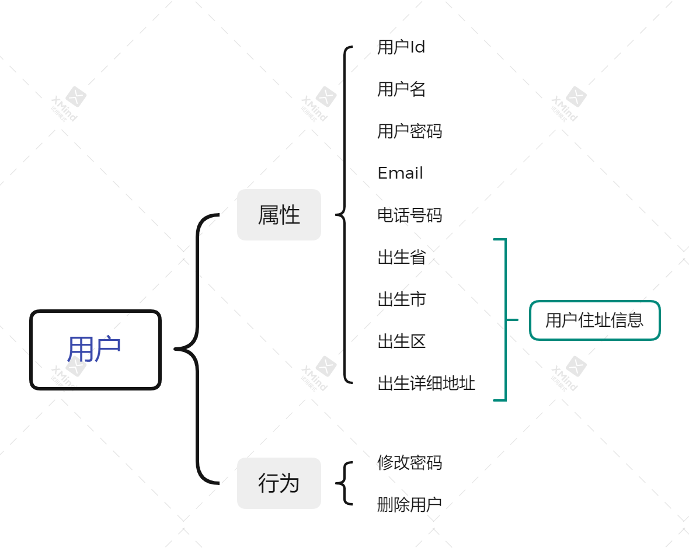
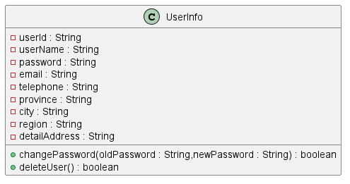
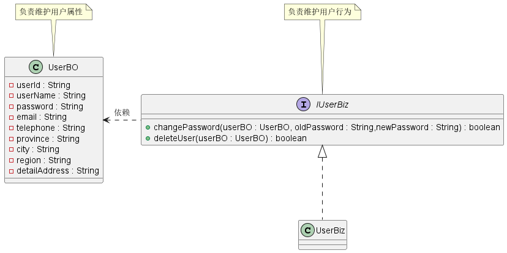
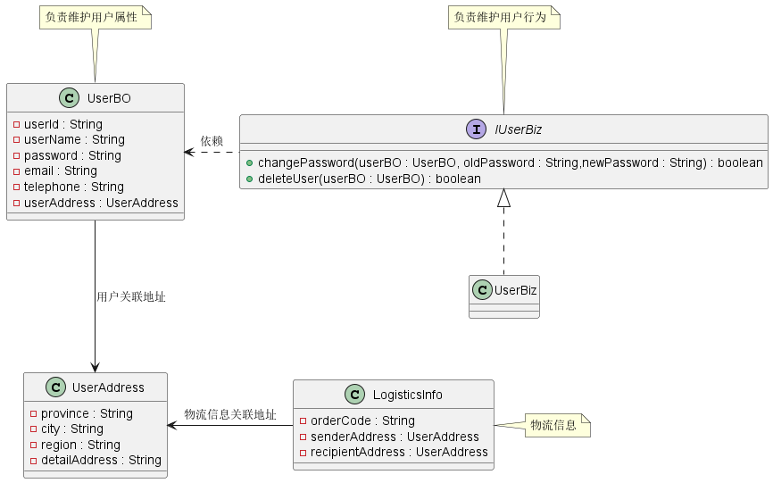
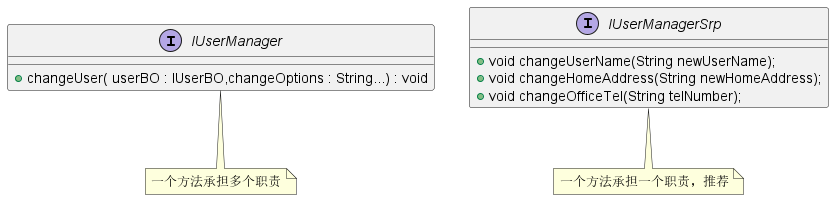

在程序设计领域，**SOLID** 是由 *罗伯特·C·马丁* 在21世纪早期引入的 记忆术首字母缩写字，代指了 面向对象编程 和 面向对象设计 的五个基本原则，它们分别是*单一职责原则（S）、开闭原则（O）、里氏替换原则（L）、接口隔离原则（I）和依赖反转原则（D）*。当这些原则被一起应用时，它们使得开发一个容易进行维护和扩展的系统变得更加可能。 

# 什么是单一职责原则？

**单一职责原则** 的英文是 Single Responsibility Principle，缩写为 **SRP**。其原始定义为：

> *A class or module should have a single responsibility.*
>
> *一个类或模块只负责完成一个职责（或者功能）。*

所谓的职责就是指引起类或模块变化的原因。如果一个类或模块有多个原因引起改变，那么这个类或模块就不符合单一职责原则。

# 为什么需要单一职责原则？

**问题**：如果类 A 负责两个职责：职责 P1 和职责 P2。当因为职责 P1 的需求发生变化时，需要修改类 A，那么就有可能导致原本运行正常的职责 P2 发生故障。

**解决方案**：从问题描述可知，如果类负责了多个职责，这些职责就耦合在了一起，那么无论哪个职责发生变化都有可能对另一职责行为产生影响。因此，我们可以遵循单一职责原则，设计成每个类都只负责一项职责，无论哪个类发生变化都不会对另一职责产生影响。

---

正确使用单一职责原则具有以下优点：

- 降低类的复杂度，一个类只负责一项职责，逻辑肯定比负责多项职责简单
- 提高类的可读性，提高系统的可维护性
- 降低变更引起的风险。在开发过程中，需求变更是不可避免的，如果遵守单一职责原则，当修改一个功能点时，可以显著降低对其他功能的影响。

# 怎么设计一个单一职责的类？

在我们项目开发中，经常会使用到用户管理，用户有很多的信息和行为需要维护，比如说修改用户信息、删除用户等功能。那么我们应该怎么设计一个符合单一职责原则的类呢？



## 不符合单一职责原则设计

首先我们考虑最简单的一种设计，将所有用户的信息和行为都放到同一个类中，当然这也是不符合单一职责原则的一种设计。设计如下：



```java
public class UserInfo {
    /**用户Id*/
    private String userId;
    /**用户名*/
    private String userName;
    /**用户密码*/
    private String password;
    /**Email*/
    private String email;
    /**电话号码*/
    private String telephone;
    /**用户住址所在省*/
    private String province;
    /**用户住址所在市*/
    private String city;
    /**用户住址所在区*/
    private String region;
    /**用户住址详细地址*/
    private String detailAddress;
    
    // ...省略 getter/setter 方法
    
    /** 修改密码 */
    public boolean changePassword(String oldPassword, String newPassword) {
        //... 省略实现
    }

    /** 删除用户 */
    public boolean deleteUser() {
        // ... 省略实现
    }
}
```

## 符合单一职责原则设计

上面的设计比较简单，但是将属性和行为都维护在 `UserInfo` 类中，那么无论属性还是用户行为发生变化都会对 `UserInfo` 类进行修改，在业务比较复杂的时候有可能会相互影响。因此我们可以使用单一职责原则对类进行重新设计，使得属性和行为的维护分开，以此隔离属性和行为之间的相互影响。



```java
public class UseBO {
    /**用户Id*/
    private String userId;
    /**用户名*/
    private String userName;
    /**用户密码*/
    private String password;
    /**Email*/
    private String email;
    /**电话号码*/
    private String telephone;
    /**用户住址所在省*/
    private String province;
    /**用户住址所在市*/
    private String city;
    /**用户住址所在区*/
    private String region;
    /**用户住址详细地址*/
    private String detailAddress;
    
    // ...省略 getter/setter 方法
}

public class IUserBiz {
    /**
     * 修改用户密码
     * @param userBO
     * @param oldPassword
     * @param newPassword
     * @return
     */
    boolean changePassword(UserBO userBO,String oldPassword, String newPassword);
    
    /**
     * 删除用户
     * @param userBO
     * @return
     */
    boolean deleteUser(UserBO userBO);
}

public class UserBiz implements IUserBiz{
    @Override
    public boolean changePassword(UserBO userBO, String oldPassword, String newPassword) {
        // ... 省略实现
    }

    @Override
    public boolean deleteUser(UserBO userBO) {
        // ... 省略实现
    }
}
```

## 更进一步思考

我们按照上述符合单一职责原则设计，那么这种设计是否就真的符合单一职责原则呢？我们可以从另一种场景进行思考，如果我们的应用系统是电商系统，那么 `UserBO` 中的地址信息是否符合单一职责原则呢？

如果是电商系统，那么就必然会有物流信息产生， `UserBO` 中的用户住址除了用于展示外，还会用于物流地址信息，这样的话在用户类中的地址信息又会涉及到两种职责，最好将其从 `UserBO` 中独立出来。



```java
public class UserAddress {
    /**用户住址所在省*/
    private String province;
    /**用户住址所在市*/
    private String city;
    /**用户住址所在区*/
    private String region;
    /**用户住址详细地址*/
    private String detailAddress;
}

public class UseBO {
    /**用户Id*/
    private String userId;
    /**用户名*/
    private String userName;
    /**用户密码*/
    private String password;
    /**Email*/
    private String email;
    /**电话号码*/
    private String telephone;
    /**用户住址*/
    private UserAddress userAddress; 
    
    // ...省略 getter/setter 方法
}

public class IUserBiz {
    /**
     * 修改用户密码
     * @param userBO
     * @param oldPassword
     * @param newPassword
     * @return
     */
    boolean changePassword(UserBO userBO,String oldPassword, String newPassword);
    
    /**
     * 删除用户
     * @param userBO
     * @return
     */
    boolean deleteUser(UserBO userBO);
}

public class UserBiz implements IUserBiz{
    @Override
    public boolean changePassword(UserBO userBO, String oldPassword, String newPassword) {
        // ... 省略实现
    }

    @Override
    public boolean deleteUser(UserBO userBO) {
        // ... 省略实现
    }
}

public class LogisticsInfo {
    /**订单编码*/
    private String orderCode;
    /**发件人地址*/
    private UserAddress senderAddress;
    /**收件人地址*/
    private UserAddress recipientAddress;
    
    // ...省略 getter/setter 方法
}
```

从上面的示例场景中，我们发现**不同的应用场景、不同阶段的需求背景下，对于同一个类的设计考虑的职责边界是不一样的。并且在软件开发设计过程中，考虑方面越多，类的数量会剧增，类之间的交互也会很复杂。因此我们在进行类或接口设计时，需要根据当前业务场景在单一职责原则和设计复杂度之间做一个折中，不要为了刻意达到单一职责原则而过大的增加系统设计复杂度。**

# 总结

单一职责原则给我们的系统设计带来了一些好处：类的复杂性降低；可读性提高；可维护性提高；变更引起的风险降低。但同时在遵循单一职责原则的同时，也给我们的系统设计带来了一些复杂性，因此我们不要过度依赖单一职责原则。

**对于接口，我们在设计时一定要遵循单一职责原则，但是对于实现类就需要多方面考虑了。生搬硬套单一职责原则会引起类的剧增，维护非常麻烦，而且过分细分类的职责也会人为增加系统的复杂性。**

对于接口、类之外，单一职责原则同样也适用于方法，也就是说一个方法尽可能只做一件事情。比如说，修改用户密码的方法，不要把这个方法放到修改用户信息里面，尽量做到每个方法只做一件事情。



# 参考资料

1. 《设计模式之禅》第1章 单一职责原则
2. [《软件修养 -- 单一职责原则（SRP：Single responsibility principle）》](https://makeoptim.com/training/single-responsibility-principle)
3. [《设计模式之美 - 王争》 理论一：对于单一职责原则，如何判定某个类的职责是否够“单一”？](https://time.geekbang.org/column/article/171771)


