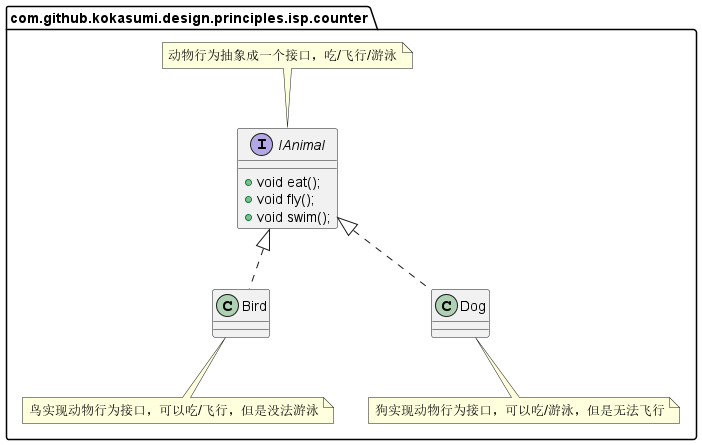
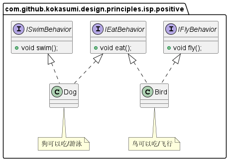

**接口隔离原则**全称为 Interface Segregation Principle，简称 ISP 。它有两种原始定义：

> *Clients should not be forced to depend upon interfaces that they don't use.*
>
> *不应该强行要求客户端依赖它们不需要使用的接口。*
>
> *The dependency of one class to another one should depend on the smallest possible interface.*
>
> *类之间的依赖应该建立在最小的接口上。*

也就是说，接口隔离原则要求拆分庞大臃肿的接口成为更小和更具体的接口，以方便客户端集中精力到它们感兴趣的接口方法。接口隔离原则的目的是系统解耦，从而易于重构，更改和重新部署。这个原则指导我们在设计接口时需要注意以下几点：

- 一个类对另一个类的依赖应该建立在最小的接口之上；
- 建立多个单一接口，不要建立庞大臃肿的接口；
- 尽量细化接口，接口中的方法尽量少。但是要注意，并不是越少越好，在进行接口拆分时，首先必须满足单一职责原则。

# 场景示例

我们可以先看一个示例，对动物行为进行抽象，如果我们不遵循接口隔离原则，将所有的动物行为都抽象成一个接口，那么我们可以得到以下类图设计：

上面没有遵守接口隔离原则的设计，`Bird` 除了可以吃/飞行外，无法游泳，但是暴露了游泳的方法； `Dog` 除了吃/游泳外，也无法飞行，但是也暴露了飞行方法。因此上面这种设计是不合理的，如果我们按照接口隔离原则进行最小接口拆分，可以将吃/飞行/游泳拆分成三种不同的行为接口，`Bird` 和 `Dog` 各自实现其需要的接口。

# 总结

接口隔离原则是对接口的定义，同时也是对类的定义，接口和类尽量使用原子接口或原子类来组装。在实践中，我们可以根据以下几个规则来进行衡量：

- 接口尽量小，但是要有限度。对接口进行细化可以提高程序设计的灵活性，但是如果过小，则会造成接口数量剧增，使设计复杂化，因此一定要适度。
- 为依赖接口的类定制服务，只暴露调用类需要的方法，它不需要的方法则隐藏起来。只有专注为一个模块提供定制服务，才能建立最小的依赖关系。
- 提高内聚，减少对外交互，使接口用最少的方法完成最多的事情。
- 运用接口隔离原则，一定要适度，接口设计的过大或过小都不好。设计接口的时候，只有多花些实践去思考和筹划，才能准确地实践这一原则。

# 参考资源

1. [接口隔离原则wiki](https://zh.wikipedia.org/wiki/%E6%8E%A5%E5%8F%A3%E9%9A%94%E7%A6%BB%E5%8E%9F%E5%88%99)
2. [软件架构设计原则之接口隔离原则](https://xie.infoq.cn/article/af6e137c8ece91f97ed9ee0c4)
3. 《设计模式之禅》第4章 接口隔离原则