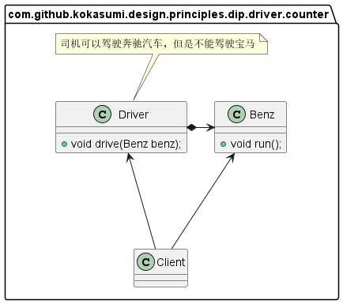
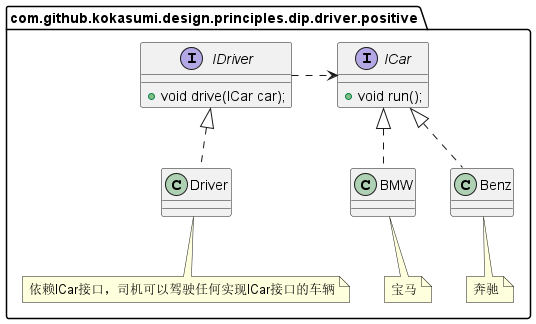

在面向对象编程领域中，**依赖倒置原则** (Dependency Inversion Principle，DIP)是指一种特定的解耦形式，使得高层次的模块不依赖于低层次模块的实现细节，依赖关系被倒置，从而使得低层次模块依赖于高层次模块的需求抽象。其原始定义为：

> *Hive level modules should not depend upon low level modules. Both should depend upon abstraction. Abstraction should not depend upon details. Details should depend upon abstractions.*

依赖倒置原则规定：

- *高层模块不应该依赖于低层模块，两者都应该依赖于抽象接口*
- *抽象接口不应该依赖于具体实现，而具体实现应该依赖于抽象接口*

# 场景示例

比如说司机驾驶汽车这个场景，就以司机驾驶奔驰汽车为例，如果不遵循依赖倒置原则我们可以使用以下类图表示：



以上类图设计，完成了司机驾驶奔驰汽车的任务，但是没办法驾驶其他车系比如宝马，因此这种设计是不合理的，我们可以通过依赖倒置原则进行重新设计。



# 依赖的三种写法

## 构造函数注入

```java
public class Driver {
    private ICar car;
    
    /**
    * 构造函数注入依赖：通过构造函数传递依赖对象
    */
    public Driver(ICar car) {
        this.car = car;
    }
    
    public void drive() {
        car.run();
    }
}
```

## Setter注入依赖

```java
public class Driver {
    private ICar car;
    
    /**
    * Setter注入依赖：通过Setter方法传递依赖对象
    */
    public void setCar(ICar car) {
        this.car = car;
    }
    
    public void drive() {
        car.run();
    }
}
```

## 方法注入依赖

```java
public class Driver {
    /**
    * 方法注入依赖：在方法参数中声明依赖对象
    */
    public void drive(ICar car) {
        car.run();
    }
}
```

# 最佳实践

依赖倒置原则的本质就是通过抽象使各个类或模块的实现彼此独立，不互相影响，实现模块间的松耦合。在项目中，我们可以遵循以下规则实现依赖倒置原则：

- 每个类尽量都有接口或抽象类，这是依赖倒置的基本要求
- 变量的类型尽量是接口或抽象类
- 开发情况下任何类都不应该从具体类派生，项目维护时不需要考虑这个规则
- 子类尽量不要覆写基类已经实现的的方法
- 结合里氏替换原则使用

*接口负责定义 `public `属性和方法，并且声明与其他对象的依赖关系；抽象类负责公共构造部分的实现；实现类准确的实现业务逻辑，同时在适当时候对父类进行细化。*

