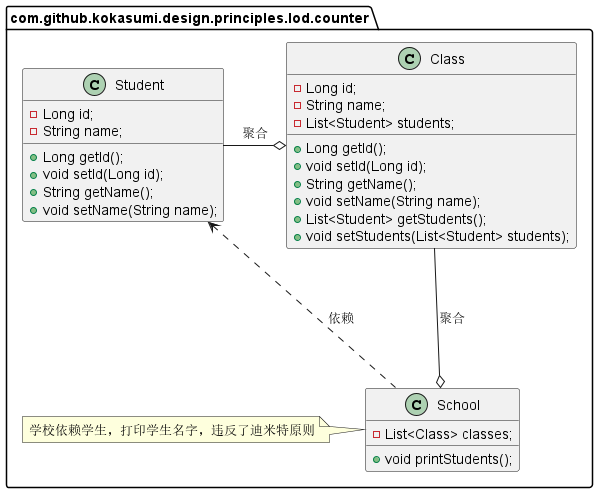
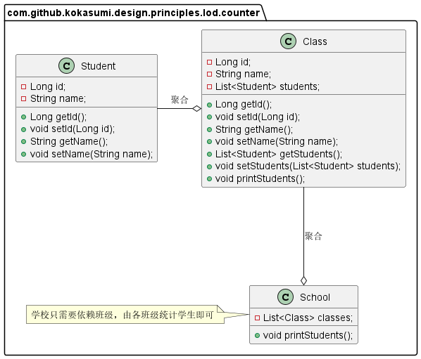

**迪米特法则**（Law of Demeter，LoD），也被称为***得墨忒耳定律***，***最少知识原则***（Least Knowledge Principle，LKP），是一种软件开发的设计指导原则。其原始定义为：

> *Talk only to your immediate friends and not to strangers*。
>
> *只与你的直接朋友交谈，不跟陌生人说话。*

迪米特法则在软件开发中的含义为：**如果两个软件实体无需直接通信，那么就不应该发生直接的相互调用，可以通过第三方转发调用**。其目的是为了降低类之间的耦合度，提高模块的相对独立性。

# 为什么需要迪米特法则？

类与类之间的关系越密切，耦合度越大，当一个类发生改变时，对另一个类的影响也就越大，因此我们需要尽量减少每个类对其他类的依赖。

迪米特法则要求限制软件实体之间的通信宽度和深度，正确使用迪米特法则有以下优点：

- *降低了类之间的耦合度，提高了模块的相对独立型。*
- *由于耦合度降低，从而提高了类的可复用率和系统的扩展性。*

# 迪米特法则理解

问：迪米特法则中的“朋友”指什么？

答：“朋友”指的是当前对象本身、对象的成员变量、当前对象所创建的对象、当前对象的方法参数等，这些对象同当前对象存在关联、聚合或组合关系，可以直接方法这些对象的方法。

---

问：迪米特法则在强调什么？

答：从依赖者和被依赖者两个方面来说，*依赖者只需要依赖应该依赖的对象；被依赖者只暴露应该暴露的方法*。

---

问：如何实现迪米特法则？

答：

- 在类的划分上，应该尽量创建松耦合的类。类之间的耦合度越低，就越有利于复用，一个处于松耦合的类被修改不会对关联的类产生太大波动
- 在类的结构设计上，每个类都应当尽量降低其成员变量和成员函数的访问权限，只要有可能，将类设计成不变类
- 在对其他类引用上，一个对象对其他对象的引用应该降到最低
- 不暴露类的属性成员，提供相应的 `get/set` 访问器
- 谨慎使用序列化（Serializable）功能，当通过序列化进行对象传输的时候，如果对象修改了属性的访问权限，而传输的另一方没有进行同步修改，会报序列化失败。

# 场景示例

比如说，打印一个学校的所有班级学生姓名。



```java
class Student {
    private Long id;
    private String name;
    // 省略get/set方法
}

class Class {
    private Long id;
    private String name;
    private List<Student> students;
    // 省略get/set方法
}

class School {
    private List<Class>  classes;
    
    // 依赖Student类，破坏了迪米特原则
    public void printStudents() {
        classes.forEach(aClass -> {
            // 打印班级名
            System.out.println(aClass.getName());
            // 打印学生名
            aClass.getStudents().forEach(student -> {
                System.out.println(student.getName());
            });
        });
    }
}
```

上述实现代码中，`School` 的设计违反了迪米特法则，`School` 与 `Student` 发生了直接关联。从逻辑上来讲，学校只需要知道有哪些班级，然后由各班级统计各自学生即可，因此 `School` 不应该与 `Student` 有任何关联。根据迪米特法则，可以将代码修改如下：

```java
class Student {
    private Long id;
    private String name;
    // 省略get/set方法
}

class Class {
    private Long id;
    private String name;
    private List<Student> students;
    // 省略get/set方法
    
    public void printStudents() {
        students.forEach(student -> {
            System.out.println(student.getName());
        });
    }
}

class School {
    private List<Class>  classes;
    
    // 依赖Student类，破坏了迪米特原则
    public void printStudents() {
        classes.forEach(aClass -> {
            // 打印班级名
            System.out.println(aClass.getName());
            // 打印学生名
            aClass.printStudents();
        });
    }
}
```



# 总结

迪米特法则可以降低类之间的耦合度，提高模块的相对独立性。但是过度使用迪米特法则会使系统产生大量中介类，从而增加系统的复杂度，使得模块之间的通信效率降低。因此，在采用迪米特法则的时候需要反复权衡，去报高内聚和低耦合的同时，保证系统的结构清晰。

# 参考资料

1. [得墨忒耳定律](https://zh.m.wikipedia.org/zh-hans/%E5%BE%97%E5%A2%A8%E5%BF%92%E8%80%B3%E5%AE%9A%E5%BE%8B)
2. [软件修养 -- 迪米特法则（LOD：Law Of Demeter）](https://makeoptim.com/training/law-of-demeter-principle)