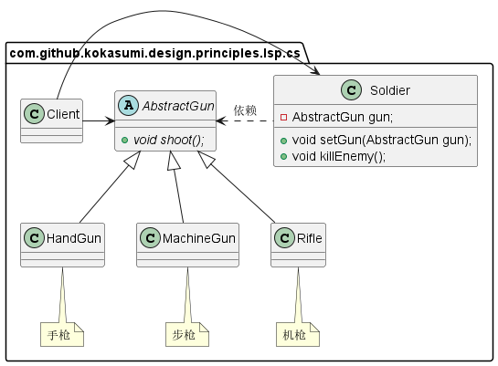
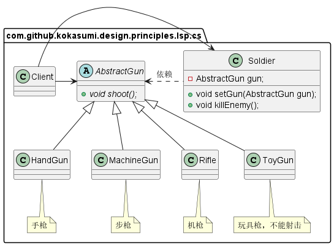
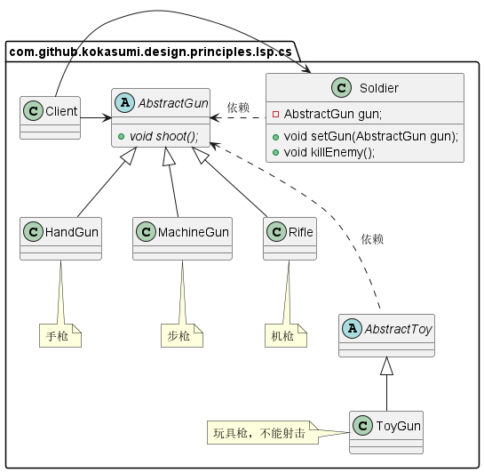
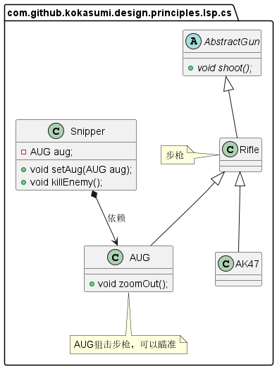

在面向对象语言中，继承是必不可少的、非常优秀的机制，它具有以下优点：

- 代码共享，减少创建类的工作量，每个子类都拥有父类的方法和属性；
- 提高代码的重用性；
- 提高了代码的扩展性，子类不但拥有父类的所有功能，还可以添加自己的功能。

但是继承也会存在缺点：

- 继承是侵入性的，只要继承，就必须拥有父类的所有属性和方法；
- 降低了代码的灵活性，因为继承时父类会对子类有一些约束；
- 增强了耦合性，当需要对父类进行修改时，就必须考虑对子类的影响。有时修改一点代码都有可能进行大段的代码重构。

那么我们该怎么发扬继承的优点，又同时减少其带来的弊端呢？解决方案是引入**里氏替换原则**(Liskov Substitution Principle，LSP)。那么什么是里氏替换原则呢？这里存在两种定义

> *If for each object o1 of type S there is an object o2 of type T such that for all programs P defined in terms of T, the behavior of P is unchanged when o1 is substitued for o2 then S is a subtype of T.*
>
> *如果对每一个S类型的对象o1，都有类型为T的对象o2，使得以T定义的所有程序P在所有对象o1都代换成o2时，程序P的行为没有发生变化，那么类型S是类型T的子类型。*
>
> *Functions that use pointers or references to base classes must be able to use objects of derived classes without knowing it.*
>
> *所有引用基类的地方必须能透明地使用其子类的对象。*

# 四层规则

里氏替换原则对继承进行了规则上的约束，这种约束主要体现在四个方面：

1. 子类必须实现父类的抽象方法，但不能重写父类的非抽象方法；
2. 子类中可以增加自己的特有方法；
3. 当子类覆盖或实现父类的方法时，方法的前置条件（即方法输入参数）要比父类方法的输入参数更宽松；
4. 当子类的方法实现父类的方法时，方法的后置条件（即方法的输出/返回值）要比父类方法更严格或相等。

通俗的来说，里氏替换原则就是 **子类可以扩展父类的功能，但不能改变父类原有的功能。**

# 场景示例

比如说，在CS游戏中用到的枪。枪的主要职责是射击，但是如何射击需要在各个具体的子类中定义，手枪是单发射程比较近，步枪威力大射程远，机枪用于扫射。在士兵类中定义一个方法 `killEnemy` ，使用枪来杀敌人，具体使用什么枪杀敌人要调用的时候才知道。

按照上面的设计来说，暂时是符合里氏替换原则的，因为在 `Soldier` 开枪杀人时都可以使用 `AbstractGun` 的子类完成开枪杀人的动作。但是如果这时候在增加一个玩具枪，按照之前的设计，也继承 `AbstractGun` 并实现抽象方法，其类图就如下所示：

上述类图设计中，玩具枪不能射击，因此在 `Soldier` 中就不能使用玩具枪这种类型来代替 `AbstactGun` 进行射击，无法完全实现父类的抽象方法，因此这种设计违背了LSP原则。

**如果子类不能完整地实现父类地方法，或者父类的某些方法在子类中已经发生 “畸变” ，则建议断开父子继承关系，采用依赖、聚集、组合等关系代替继承。** 因此玩具枪可以脱离继承，单独建立一个独立的父类，其类图如下所示：

子类也可以有自己特有的方法，比如说步枪分为 AK47 和 AUG 狙击步枪两种，而 AUG 狙击步枪除了射击之外，还具有瞄准的方法。那么将这两个子类引入后的 `Rifle` 子类图如下表示：

# 参考资料

1. 《设计模式之禅》第2章 里氏替换原则