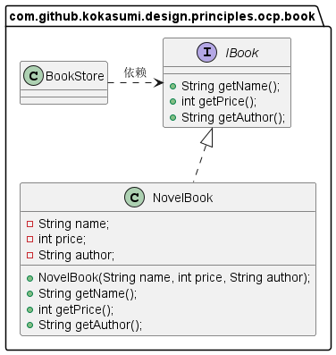
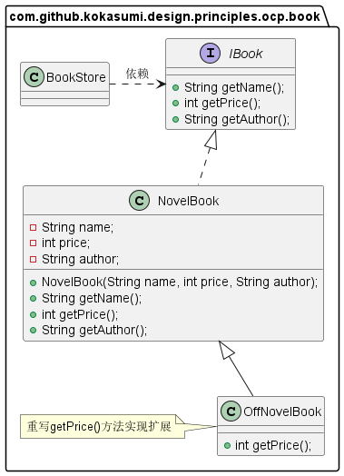
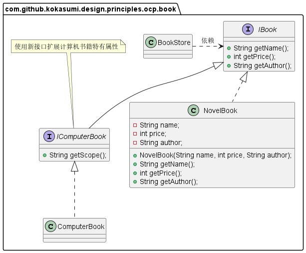

**开闭原则**英文缩写为 **OCP**，全称为 The Open/Closed Principle。其原始定义为：

> *Software entities like classes, modules and functions should be open for extension but closed for modifications.*
>
> *软件中的对象（如类、模块、函数等）应该对于扩展开放，但是对于修改关闭。*

开闭原则意味着一个实体应该通过扩展来实现行为变化，而不是通过修改已有代码来实现变化。该特定在产品化的环境中是特别有价值的，在这种环境中，改变源代码需要代码审查、单元测试等用于确保产品使用品质的过程，遵循开闭原则可以在实现需求行为变更的同时无需重复以上过程。

其实开闭原则无非是想表达这样一层意思：**用抽象构建框架，用实现扩展细节**。因为抽象灵活性高，适应性广，只要抽象的合理，可以基本保证软件架构的稳定。而软件中易变的细节，可以从抽象派生出的实现类进行扩展，当软件需要发生变化时，我们只需要根据需求重新派生一个实现类即可。

# 场景示例

以书店销售书籍为例，书有三种属性：名称、价格和作者。我们可以用以下类图设计实现：

上述代码中，书店 `BooStore` 依赖于 `IBook` 接口，`NovelBook` 类实现了 `IBook` 接口，在其中返回了小说书的书名，作者，价格。但是从2019年开始，受疫情影响，全球经济下滑，书店为了生存开始打折销售：所有 40 元以上的书籍 9 折销售，其他的书籍 8 折销售。对于已经实现的类来说，书籍价格是一个变化，我们可以采取 3 种方式来解决价格变化：

1. 在 `IBook` 接口上新增一个方法 `getOffPrice()` ，专门用于打折处理，所有实现类都实现该方法。但是这样做影响到所有 `IBook` 接口的实现类，并且 `IBook` 作为接口应该是稳定可靠的，不应该经常发生变化，否则接口作为契约的作用就丢失了。因此该方案否定。
2. 修改 `NovelBook` 实现类，在获取价格方法内部进行打折处理，但是这种处理方式有一个问题，如果采购书籍人员想看到打折前的价格，就无法实现了，并且这种也是违背开闭原则的。因此该方案也被否定。
3. 通过扩展实现变化，我们可以增加一个 `NovelBook` 的子类 `OffNovelBook`，重写获取价格方法，这样就可以不用修改原有代码，直接扩展实现。

如果书店新增了计算机书籍，它不仅包含书籍名称、价格和作者，还有一个独特的属性：领域。那么我们也可以新增加一个接口 `IComputerBook` 来实现扩展。

# 总结

**开闭原则只是一种思想，没有具体实际操作方法，其他五项原则则是为了实现开闭原则提供的一些方法，也就是说只要遵循了其他五项原则，设计出来的软件自然是符合开闭原则的**。单一职责告诉我们实现类职责要单一；里氏替换法则告诉我们不要破坏类继承体系；依赖倒置原则告诉我们要面向接口编程；接口隔离原则告诉我们在设计接口时要精简单一；迪米特法则告诉我们要降低耦合。开闭原则是总纲，它告诉我们要对扩展开放，对修改关闭。

# 参考资料

1. 《设计模式之禅》第6章 开闭原则
2. [软件修养 -- 开闭原则（OCP ：Open Closed Principle）](https://makeoptim.com/training/open-closed-principle)
3. [设计模式六大原则（6）：开闭原则](https://blog.csdn.net/zhengzhb/article/details/7296944)