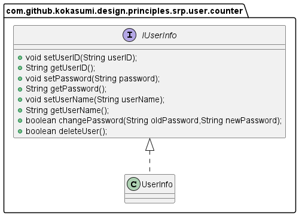
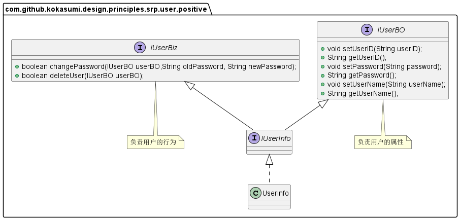

**单一职责原则**英文缩写**SRP**，全称为Single Responsibility Principle。其原始定义为：

> *There should never be more than one reason for a class to change（应该有且仅有一个原因引起类的变更）.*  

单一职责原则要求一个接口或类只有一个原因引起变化，也就是说每个接口或类只负责一件事情。

# 场景示例

比如说，在我们项目开发中，设计一个用户管理的接口，用户有很多的信息和行为需要维护，比如说修改用户信息、增加机构、增加角色等功能，我们可以将其封装在一个接口中。

上面这种接口设计有一种很严重的错误，用户的属性和行为没有分开，导致接口或实现类会因为属性或行为的变更引起变化，违背了单一职责原则。

按照单一职责进行设计，我们可以`IUser`拆成两个接口，`IUserBO`负责用户属性的维护，收集和反馈用户的属性信息；`IUserBiz`负责用户的行为，完成用户信息的维护和变更。

在上述类图中，我们将用户的属性和行为维护分开，但是从本质上来讲，并没有完全遵循单一职责原则，因为无论是属性还是行为发生变化都会引起`IUserInfo`发生变更。因此在实际使用中，我们更倾向于使用连个不同的类或接口来分别实现`IUserBO`和`IUserBiz`，并使用依赖的方式进行关联。

# 单一职责的标准是什么？

单一职责要求一个接口或类只有一个原因引起变化，那么怎么确定职责边界呢？是否必须要严格遵守单一职责标准呢？举个例子，我们平时电话通话过程中有4个过程：拨号、通话、回应和挂机。那么我们可以写一个接口，其类图如下所示：

从上面接口设计来看，这个接口好像满足单一职责原则，因为接口中的所有过程都与通话过程有关。但如果我们再往下细分，通话过程又可以分成两个职责：一个是协议管理，一个是数据传送。`dial()` 和 `hangup()` 两个方式实现的是协议管理，分别负责拨号接通和挂机；`chat()` 方法负责的是数据传送，将我们说的话转换成模拟信号或数字信号传递到对方。因此再细分为了满足单一职责原则，我们可以将通话过程拆分为两个接口，其类图如下：

以上类图设计完全满足了单一职责原则的要求，协议变更和数据传送方式变更不会相互影响，但是 `Phone` 必须将`ConnectionManager` 和 `DataTransfer` 组合在一起才能使用，组合是一种强耦合关系，这种设计增加了复杂性。因此我们可以考虑修改一下类图，通过一个 `Phone` 类实现两个接口，把两个职责融合在一个类中，因为我们一般都是面向接口编程，对外公布的是接口而不是类，因此我们可以使用这种方式在单一职责原则和设计复杂性之间做一个折中。

**单一职责原则提出了一个编写程序的标准，用 “职责” 或 “变化原因” 来衡量接口或类的设计是否优良，但是 “职责” 和 “变化原因” 都是不可衡量的，因项目而异，因环境而异。**因此在开发设计中，我们需要在单一职责原则与设计复杂性之间做一个折中，不要为了刻意达到单一职责原则而过大的增加设计复杂性。

# 总结

单一职责原则给我们的系统设计带来了一些好处：类的复杂性降低；可读性提高；可维护性提高；变更引起的风险降低。但同时在遵循单一职责的同时，给我们的设计带来了一些复杂性，因此我们不要过度依赖单一职责原则。

**对于接口，我们在设计时一定要遵循单一职责原则，但是对于实现类就需要多方面考虑了。生搬硬套单一职责原则会引起类的剧增，维护带来非常多的麻烦，而且过分细分类的职责也会人为地增加系统的复杂性。**

除了接口，类之外，单一职责原则同样适用于方法，也就是说一个方法尽可能做一件事情。比如说，一个修改用户密码的方法，不要把这个方法放到修改用户信息里面，尽量做到每个方法只做一件事情。

# 参考资料

1. 《设计模式之禅》第1章 单一职责原则
